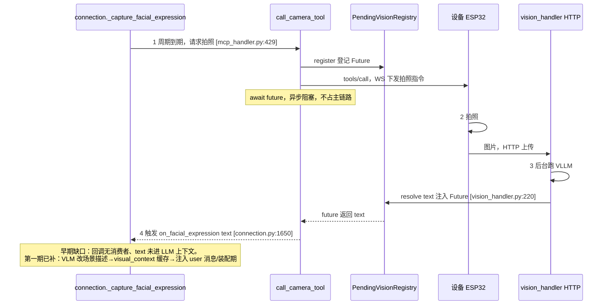
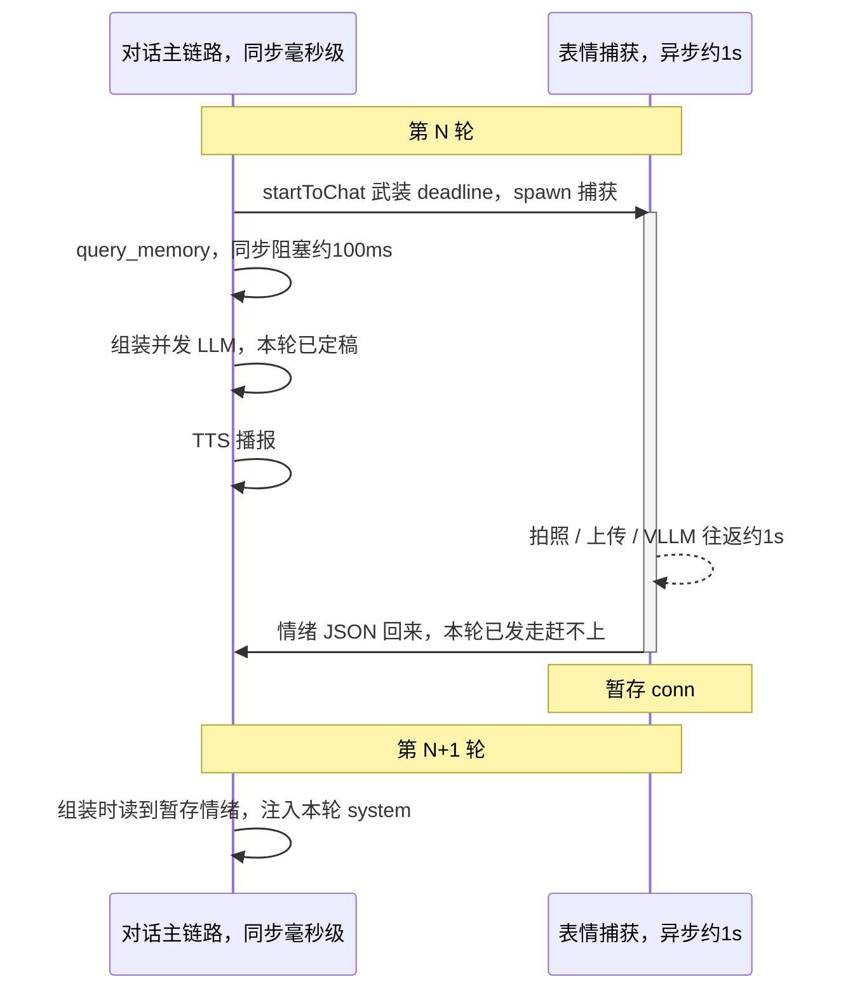
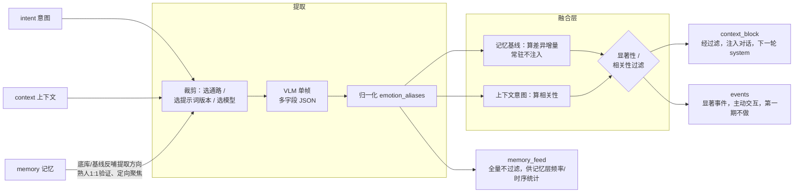

# 视觉感知融合模块设计方案

> **设计目标**：构建多通路视觉信息提取机制，实现有效视觉信息的融合处理，支撑视觉增强对话、视觉实时交互、记忆沉淀三类下游应用场景。
> 
> 
> 
> **设计思路**：以人类视觉交互的核心能力为参照，对标实现机器人对应的视觉感知能力。
> 
> 
> 
> **更新日期**：2026\-07\-16
> 
> 

---


## 0\. 当前架构与设计边界

以下为现有架构的既定现状，是本方案设计与落地的基础约束边界。


### 边界一：视觉结果已回流至服务端，但未注入大语言模型上下文

视觉链路采用 `PendingVisionRegistry` 异步注入模式：

- `call_camera_tool`（`mcp_handler.py:429`）注册一个 `Future` 对象，并向设备下发 `self_camera_take_photo` 指令；设备通过HTTP将图片上传至 `vision_handler`，后者后台运行视觉大模型（VLLM）并调用 `registry.resolve()` 向 `Future` 注入结果（`vision_handler.py:220`），`call_camera_tool` 获取文本结果后返回。

- 因此VLLM输出的文本结果会回流至服务端Python进程：`_capture_facial_expression`（`connection.py:1653`）获取 `expression_text` 后，触发 `on_facial_expression` 回调（`connection.py:1650`）。

- **待填补的能力缺口**：`on_facial_expression` 回调钩子在全代码库中无任何消费逻辑，也没有对应链路将视觉文本注入LLM上下文。因此本方案的核心工作并非从零搭建视觉信息接入LLM的完整架构，而是**实现回调消费逻辑 \+ 补充上下文注入通路**。

该链路跨设备端、`vision_handler`、注册中心、`connection` 四层模块，通过共享 `Future` 对象实现异步结果汇聚。链路核心特征为**指令下发与结果回流分属两条独立路径**：MCP指令通过WebSocket下发，图片通过HTTP上传，二者在 `Future` 处完成汇合。时序如下：



> 关键说明：**指令下发走WebSocket、图片上传走HTTP，为两条独立路径**，最终在共享 `Future` 处汇合——`call_camera_tool` 通过 `await future` 挂起，直到 `vision_handler` 将VLLM结果 `resolve` 注入后才返回。
> 
> 


### 边界二：周期性感知触发机制已就绪（第一期已改为"活跃期固定间隔"独立循环）

服务端已具备完整的周期拍照机制。**第一期实现现状**（分支 `visual-context-llm-expression`，早期"绑定对话轮次"的触发已被替换）：

- **采集节奏 = 设备活跃期间按固定间隔周期拍照，不再绑对话轮次**。新增独立后台循环 `facialCaptureHandle.facial_capture_loop`（比照 `blink_loop`/`expression_animation_loop`），每 2 秒轮询一次：设备"活跃"且到期就调 `spawn_facial_capture()`。旧的"轮次开始武装 deadline + `_check_timeout` 超时补拍"两处代码已删除（`receiveAudioHandle.startToChat`、`sendAudioHandle` 的清零），`facial_expression_deadline` 现仅由该循环单点读写。

- **"活跃"判定**：复用现有 `conn.last_activity_time`（检测到**用户**人声时刷新），`idle_ms = now - last_activity_time`，`active = idle_ms <= facial_expression_idle_timeout*1000`。已知取舍：assistant 长独白期间（用户不说话）会暂停拍照，是复用现有信号的代价，第一期接受。

- **配置项**（`private_config > env > config.yaml` 三级覆盖，设 0 关闭）：
  - `facial_expression_interval`：活跃期拍照固定周期，**默认值已由 30 改为 10（秒）**。
  - `facial_expression_idle_timeout`（**新增**）：判活跃的空闲阈值，默认 **60 秒**。注意与既有 `facial_expression_timeout`（默认15秒，指单次拍照+VLLM调用超时）含义不同，勿混淆。

- 机制已包含 MCP 握手竞态处理、`_facial_expression_running` 并发防护、单次超时兜底、连接关闭时任务取消（`close()` 里 cancel + `wait(timeout=2.0)`）等能力。

- **第一期不新增独立触发链路之外的采集改造**；真正的两处新增在别处：VLM 提示词改为"场景描述"（见第2章）、结果注入对话上下文/记忆（见第3章场景A）。

> 演进注记：`facial_expression_interval` 默认 10 秒是第一期在"情绪已不走 VLM（见场景A现状）"后放开的值——VLM 现在只做低频场景描述，429 顾虑下降。第二期专用模型上线后可再据本地算力重估（见第6章、第7章第1条）。

### 边界三：VLM仅负责单帧观测，长短期时序能力归属记忆层

归一化引擎（`prompts/emotion_aliases.json`）已完成原型开发，同名异物、同物异名的一致性统一通过该层实现，不由VLM承担。跨帧统计、事件确认能力同样归属记忆层，本模块仅负责输出稳定、归一化的单帧观测数据流。

---


## 1\. 能力映射：人类视觉行为 → 机器人感知能力

本方案以人类视觉的实际应用场景为锚点，匹配对应的机器人感知能力，同时明确下游落地场景与能力可靠性边界。可靠度数据来源于`test/pipeline_tests/VLM识别能力测试报告.md`（基于受控数据集得出，为乐观上限值，真机环境需重新实测验证）。


|人类视觉行为|对应机器人感知能力|支撑下游场景|实测可靠度（受控样本库下为乐观上限）|
|---|---|---|---|
|判断对话对象身份|人物在场检测、人数统计、熟人/陌生人区分|交互 \+ 记忆|第一期不做；**第二期专用人脸识别模型**做1:1验证（非VLM）。通用VLM 1:1参考准确率96%，1:N场景VLM无法稳定输出（详见能力对比报告）|
|根据对方情绪调整对话语气|粗粒度情感识别|对话|第一期通用VLM粗五分类可靠（高兴/惊讶/平静可靠，负面统称）；细粒度闭集49%/开放归一55%不足以支撑决策，**第二期专用情绪识别模型**补细分|
|判断对方是否关注自己、是否分心|注意力检测、人脸朝向判断|交互|人脸朝向可检测（未专项测试，保守归为粗粒度能力）|
|结合"这个/那个"等指代与手势/手持物品理解|指代消解（手持/指向物体定位）|对话|物体粗分类能力强（物种识别准确率100%），支持画面内九宫格定位|
|判断所处环境、当前活动|场景分类 \+ 活动识别|对话 \+ 记忆|闭集场景枚举识别结果可靠|
|察觉新物体出现、有人进入|帧间变化检测、事件识别|交互 \+ 记忆|归属记忆层跨帧统计能力，非VLM单帧可实现|
|沉淀环境稳定事实（住址、宠物、家具位置）|高频稳定信息沉淀|记忆|通过频率统计实现，VLM仅提供观测数据流|


**核心设计原则：以能力边界约束方案设计。** 基于实测结论反向约束设计范围：

- **细粒度识别能力不足 → 降级使用或调整应用场景**：第一期情感仅输出五大粗分类，**不产出细粒度情绪**（要细分负面情绪留待第二期专用情绪识别模型，见第6章）；物体细粒度类别仅用于记忆沉淀，不作为交互决策的直接依据。

- **1:N身份识别不可靠 → 调整问题形态 + 换专用模型**：身份识别不采用开放域1:N识别模式。第一期不做身份（空快照降级）；**第二期改用专用人脸识别模型**（face-embedding底库 + 1:1验证，非VLM），将VLM不擅长的开放问题交给专用模型处理。（下表96%为通用VLM在受控库上的1:1能力参考，非第二期实现基础。）

- **单帧无时序推理能力 → 时序逻辑交由记忆层实现**：VLM仅标注“当前帧疑似存在挥手动作”，不做“用户刚进门”这类时序因果判断，跨帧逻辑关联由记忆层实现。

---


## 2\. 视觉提取通路设计

### 2\.1 现状与升级方向

**最初**单帧视觉提取采用识别表情的自由文本提示词（*"请识别图片中人脸的表情…例如'开心''疑惑''平静''惊讶''难过'…"*）。

**第一期已改**（分支 `visual-context-llm-expression`）：VLM 提示词换成**场景描述**——*"请用一句简短的中文描述这张图片的画面内容，均衡涵盖人物（如有人，简述其动作和神态）、所处环境和显著物品，控制在40字以内…"*，输出仍是**自然语言**（非结构化 JSON），经 `visual_context.py` 注入对话/记忆；情绪已不由 VLM 承担（改 LLM emoji，见场景A）。

**存在的问题（就"结构化"而言）**：自然语言场景描述便于直接注入对话，但**无法被下游按字段结构化消费**（归一化、显著性判定、记忆频率统计等依赖字段化数据）。这是第一期的务实取舍——先打通"视觉进上下文/记忆"链路；结构化多字段升级留待下述升级方向 / 第二期。


**升级方向：单次VLM调用输出多字段结构化JSON结果。** 不采用“单通路单次VLM调用”的模式（会带来N倍的延迟与额度消耗），各信息通路对应JSON中的字段分组。核心依据为**单次调用可摊薄网络往返开销**——实测表明单图API的网络往返是延迟主要来源（flash模型p50延迟约1s，详见延迟测试报告），多次调用会导致延迟与额度成本成倍增长。

> **演进注记（第二期）**：该"单次VLM多字段"结论适用于**通用理解型字段**——场景B、物体C、活动D。而**人物级字段**（`identity`身份、`emotion`情绪）第二期将剥离到**专用模型**（人脸识别 / 情绪识别，非VLM），不再走这次VLM调用。剥离后本次VLM调用主要承载B/C/D通路；人物级由专用模型旁路产出、在融合层合并（见第4章 perceive 编排与第6章模型分工）。第一期仍由通用VLM统一输出含粗情感的多字段JSON，本结论第一期完全成立。


### 2\.2 通路划分（对应JSON字段分组）

- **通路A · 人物信息**：包含`present`（是否存在清晰人脸）、`count`（画面人数）、`identity`（熟人ID/陌生人）、`emotion`（情绪粗分类）、`attention`（是否面向镜头）、`appearance`（粗粒度外观特征，如佩戴眼镜、身着外套等，支撑自然对话表达）。
  - **字段来源分期**：第一期全部由通用VLM输出，其中`identity`因不做身份而恒为unknown（空快照降级）、`emotion`为粗五分类。**第二期**：`identity`改由专用人脸识别模型（embedding+底库1:1）产出，`emotion`改由专用情绪识别模型产出，二者不再从VLM的JSON取；`present/count/attention/appearance`仍可由VLM或人脸模型的检测结果提供。合并逻辑见第4章 perceive 编排。

- **通路B · 场景信息**：包含`scene_type`（闭集枚举：客厅/卧室/办公室/会议室/教室/商店等）、`lighting`（明亮/昏暗/自然光）、`time_hint`（白天/夜晚线索）。

- **通路C · 物体信息**：实体列表格式为 `[{name(半开放规范通用名), category(闭集分类), attributes, region(画面九宫格), state}]`。名称采用半开放输出，下游经归一化引擎统一命名（复用 `emotion_aliases` 同款硬映射机制）。

- **通路D · 活动/指代信息**：包含`activity`（吃饭/工作/看手机）、`deixis`（对话出现“这个/那个/我手里的”等指代时，定位被指向/手持的物体，支撑指代消解）。

- **通路E · 帧内动态提示**：`dynamic_hint` 仅标注“当前帧疑似瞬时动作”（如挥手/起身），**不做时序因果判断**，仅作为记忆层短时连续检测的输入原料。

### 2\.3 按意图裁剪提示词（降低Token消耗）

各通路可根据业务意图（`intent`）动态裁剪启用范围：环境巡检模式（`ambient`）仅启用A、B通路精简版；用户定向提问场景（`user_query`）仅启用C、D通路定向版。避免全字段输出带来的token损耗——该机制是第6章额度管控的必要支撑，而非可选优化项。


### 2\.4 前置改造：Provider参数化（结构化输出的基础）

结构化JSON输出依赖Provider支持温度系数、JSON模式、思维链开关等参数透传，但当前`core/providers/vllm/openai.py`未实现参数有效透传：

- `__init__`方法（第20\-35行）**已读取**`max_tokens`、`temperature`、`top_p`等配置并存为实例属性；

- 但`response()`方法（第60\-62行）发起实际请求时，**仅传递了**`model`、`messages`、`stream`三个参数——已读取的配置参数全部未生效，同时缺少`response_format`（JSON模式）与思维链开关的配置能力。

即存在“参数已读取但未实际透传至API请求”的问题。根据VLM能力评测结论，结构化提取需要满足“关闭思维链 \+ 温度系数0\.2 \+ JSON模式”的配置要求，当前Provider均无法支持。


因此本模块落地的首要步骤是改造`response()`方法，将已读取的参数完整传入`chat.completions.create`接口，并新增`response_format`与思维链开关的参数透传能力。该改造是所有结构化输出能力的基础，优先级最高。

---


## 3\. 核心场景落地流程

### 场景A：情感感知增强对话 （完整落地示范）

> ## ⭐ 第一期实现现状（分支 `visual-context-llm-expression`，与下方前瞻设计有重大出入，以此为准）
>
> 第一期落地时走了一条比"VLM 做情感 → `<visual_state>` 注入"更务实的路，本节下方"提取提示词/信息处理流程/时序耦合/备用方案"是**前瞻设计（第二期专用情绪模型的目标形态）**，第一期**并未按其实现**。第一期实际是：
>
> 1. **VLM 不做情感，改做"一句话场景描述"**。拍照后发给 VLM 的提示词已改为：*"请用一句简短的中文描述这张图片的画面内容，均衡涵盖人物（如有人，简述其动作和神态）、所处环境和显著物品，控制在40字以内…"*（`connection.py`，非下方那段情感 JSON 提示词）。
> 2. **场景描述缓存 + 注入对话/记忆**（新模块 `core/utils/visual_context.py`）：`_capture_facial_expression` 把 VLM 描述存成不可变快照 `VisualContext{description, captured_at}`。消费两级——
>    - **主路径 `consume_for_turn`**：用户开口(`startToChat`)时若快照新鲜(TTL 默认 30s)且未入库，把 `【画面】…` 附到**该轮 user 消息**里 → 进对话历史(跨轮可见、可被记忆总结写入长期记忆) + 复用于 ASR 聊天记录上报。同一快照只随一轮入库。
>    - **兜底 `get_realtime_line`**：快照新鲜但未入库时，`chat()` 装配期临时注 `【实时信息】当前画面（约N秒前）：…`，只活单次请求、不进历史。
>    - 注意：注入目标是 **user 消息 / 装配期**，不是下方设计的"追加 system 末尾的 `<visual_state>`"。
> 3. **情绪/舵机表情不来自视觉，改由 LLM 回复的 emoji 驱动**：`textUtils.get_emotion` 解析 LLM 回复文本首个 emoji → 情绪英文词 → `connection._handle_emotion_and_expression` 经 `expressionActionHandle.EMOTION_TO_EXPRESSION` 映射为舵机表情动画（`funny/laughing→大笑`、`sad/crying→悲伤` 等 10 个有把握映射；`happy` 是兜底值故意不映射，一轮最多分发一次）。旧的"VLM 自由文本关键词匹配表情"(`match_expression`)已删除。
>
> **因此第一期两条能力线**：①视觉(VLM) → 场景描述 → 上下文/记忆（≈本文档"场景B"的形态，而非情感）；②情绪表达 → 走 LLM emoji → 舵机（纯文本侧，不是视觉任务）。**第二期**才由专用情绪识别模型补回"基于视觉的情绪"，届时复用注入尾巴（见第6章）。
>
> 下方内容作为**第二期专用情绪模型的目标设计**保留参考。

**支撑能力**：通路A的粗粒度情感识别能力。


**触发机制**：**复用主线程已有的****`_capture_facial_expression`****周期任务**（对应`connection.py:1653`），不新增独立触发链路。对话轮次启动时，`startToChat`已触发首帧图像捕获（对应`receiveAudioHandle.py:64`），捕获节奏见边界二（每轮一帧 + 长时无对话时按`facial_expression_interval`周期补采）。**主方案仅需完成两项改造：替换视觉提取提示词、实现回调消费逻辑**；若第一期同时启用后文的**备用方案**（当轮同步补采），则在此之外另需补采触发、同步等待、启用开关三项（详见第5章落点表）。


**提取提示词配置**：关闭思维链、温度系数0\.2、启用JSON模式；情绪粗分类基于实测结论设置，高兴、惊讶、平静三类识别可靠，负面情绪不做细分。**替换**`connection.py:243`处现有的自由文本提示词，内容如下：

```Plain Text
你是视觉情感观测器。仅识别画面中距离镜头最近、最清晰的人脸，判断其当前情绪。
仅可从以下粗分类中选择一项输出：高兴 / 惊讶 / 平静 / 负面 / 看不清。
"负面"为愤怒、厌恶、悲伤、恐惧的统称，无需区分具体类型。
仅输出JSON，不添加任何解释文字：
{"present": true|false, "emotion": "上述五选一", "salience": 0.0-1.0}
present：是否存在可清晰识别的人脸；salience：情绪表达强度，数值越高越明显。
```

> 注意：该提示词的JSON输出依赖Provider完成第2\.4节的JSON模式改造；若未完成改造，小模型可能返回附带解释文字的非标准JSON，需配套与`kill_switch.py`同款的容错解析逻辑作为兜底。
> 
> 


**信息处理流程**：

```Plain Text
_capture_facial_expression 周期触发（已有机制）
  → call_camera_tool 获取VLLM输出的JSON文本（已有链路）
  → 触发on_facial_expression回调（已有钩子，本方案新增消费逻辑）
  → 归一化处理（通过emotion_aliases硬映射统一表述，如“开心”映射为“高兴”）
  → 时序平滑处理（近N帧滑窗投票，过滤单帧噪声）    ← 状态存储于conn对象，跨轮次累积
  → 显著性判定：情绪非平静且稳定持续 → 标记为“可注入状态”
  → 渲染生成<visual_state>标签，写入conn的待注入缓冲区
```


**上下文融合方案（核心改造点，复用****`dialogue.py`****已验证的注入范式）**：

`get_llm_dialogue_with_memory`方法（`dialogue.py:126`）已具备两条成熟的注入路径：`<memory>`标签的正则替换路径（第169\-175行），以及`tool_rules`追加至system消息末尾的路径（第178\-179行）。


本方案**平行新增****`<visual_state>`****注入通路**，采用与`tool_rules`一致的“追加至system消息末尾”模式，而非`<memory>`标签的“替换预留标签”模式。


**选择追加至system末尾而非注入user消息的原因**：

`dialogue.py`第176\-177行的注释已说明核心依据：追加至system消息末尾，经对话模板渲染后紧贴上下文，且不进入对话历史，可避免被模型判定为“最新用户消息”而触发错误的响应逻辑。


情绪状态标签同理：若注入user消息，模型会将其识别为用户输入，进而生成“你为什么说我不开心”这类不符合预期的响应。该决策直接复用现有代码已验证的结论，不新增独立方案。


渲染示例：

```Plain Text
<visual_state ts="14:32">
对话对象：主人（已识别）。情绪：负面，已持续约20秒，强度中等。
</visual_state>
```


系统提示词追加使用规则（自然含蓄是人际交互的核心原则）：

```Plain Text
<visual_state> 是你"看到"的实时状态，仅用于调整你的对话方式，不可作为事实直接复述。
- 若对方情绪偏负面：语气更柔和关切、语速放缓，先共情再回应内容。
- 绝对禁止机械说出"我看到你不开心""我检测到你的表情"——人类日常对话不会这样表达。
- 情绪无法识别或状态为平静时，按正常模式对话，忽略该标签。
```


#### ⚠️ 时序耦合决策（核心落地问题）

`chat()`方法（`connection.py:957`）以同步方式组装LLM请求，`query_memory`在第1052行同步阻塞获取记忆数据后，立即发起LLM请求。而`_capture_facial_expression`是**异步周期任务**，flash模型的VLM往返p50延迟约1s，p95长尾延迟更长。**单帧情绪识别结果通常无法同步用于当前轮次的LLM请求组装**。


对话主链路为毫秒级同步推进，表情捕获为秒级异步推进，二者并行运行——当VLM识别结果返回时，当前轮次的LLM请求通常已发出（下图为**主方案**时序；备用方案的当轮同步见后文）：




因此明确设计决策：**情绪状态标签注入下一轮（及后续轮次）的system消息，接受一轮延迟**。依据如下：

- 情绪属于持续状态而非瞬时事件，滞后一轮（数秒）不会影响“调整语气、柔和回应”的核心目标；

- 若强制等待VLM结果再发起LLM请求，会将p95长尾延迟（12\~20s，详见延迟报告）直接叠加到用户感知的首字延迟（TTFB）上，体验损失过大；

- 与`query_memory`“读取当前可用状态、不阻塞主链路”的既有设计取舍保持一致。

否决方案：同步等待VLM结果。否决理由：长尾延迟不可控，用户体验损失严重。

**备用方案：当轮同步补采（前提——产品侧可接受每轮首字延迟增加约1~2s）**

上述否决基于"长尾不可控"，但该结论针对的是glm-4.6v（p95长尾12~20s）。情感场景A 本就属环境巡检类、默认用 flash（p50约1s、p95约2.5s，详见延迟报告，与第6章模型选型一致）——flash 的低长尾特性叠加硬超时上限，即可将长尾截断在可接受区间内。此时可让情绪用于**当前轮**而非滞后一轮：

- **触发**：用户开口（`startToChat`）时，除周期捕获外，额外补采一帧，保障情绪与本轮对话强相关（而非复用可能已过时30s的周期帧）。
- **同步等待**：在`chat()`组装LLM请求前（`query_memory`同款位置，`connection.py:1052`附近），同步`await`本帧的VLM future，但**超时上限设为1~2s**——区别于`call_camera_tool`现有的15s超时（`facial_expression_timeout`，那是给设备端MCP的宽松上限），此处必须卡死在体验可接受区间。
- **降级**：超时或识别失败 → 回退主方案，改用conn暂存的上一轮情绪（滞后一轮），绝不无限等待。
- **实际效果**：flash p50约1s，多数轮次能在上限内拿到当前帧情绪并注入本轮system；少数p95长尾轮次超时后降级为滞后一轮。即"常态当轮、长尾滞后"的混合策略，比纯主方案实时性更好，比纯同步等待更稳。

**关键约束（真机延迟账）**：延迟报告的约1s是**VLM api往返**，不含设备端拍照 + HTTP上传。真机整链路（拍照 → 上传 → VLLM）更长，超时上限建议取2s并以真机实测校准；若真机p50已逼近2s，说明当轮同步不划算，应退回主方案。

**与主方案的关系**：主方案（滞后一轮、不阻塞）为默认；本备用方案是"以TTFB换情绪实时性"的可选项，由`facial_expression_interval`之外新增一个开关控制。两者共用同一套提取/归一化/注入逻辑，差异仅在"何时注入"——因此可低成本并存，按产品对延迟的容忍度切换。


**输出产物**：`{emotion, salience, stable_since}`结构化数据 \+ 渲染完成的`<visual_state>`标签块，暂存于conn对象中，在下一轮`get_llm_dialogue_with_memory`组装上下文时追加至system消息。


### 场景B：场景/环境感知 → 情境化对话 \+ 记忆沉淀

> **第一期实现现状**：第一期的 VLM 实际做的正是本场景的**简化形态**——但产出不是下方的结构化 JSON，而是**一句自然语言场景描述**（40字内，涵盖人物动作神态+环境+物品），经 `visual_context.py` 注入当轮 user 消息/装配期（见场景A"第一期实现现状"）。即：**第一期 = 场景B的自然语言简化版 + 情绪走LLM emoji**；下方结构化多字段 JSON（scene_type/objects 分字段 + 融合层差异注入）是**第二期**目标形态。

**支撑能力**：通路B \+ 通路C。


**提取提示词**（`ambient`意图精简版，闭集枚举 \+ 半开放物体名）：

```Plain Text
你是环境观测器。仅输出JSON，不加解释：
{"scene_type":"客厅/卧室/办公室/会议室/教室/商店/其他 之一",
 "lighting":"明亮/昏暗/自然光 之一",
 "objects":[{"name":"通用名","region":"九宫格(左上/上/右上/左/中/右/左下/下/右下)","state":"简述或null"}]}
objects 仅列画面中显著、可命名的物体，最多8个；没有则空数组。
```


**信息处理流程**：

```Plain Text
周期帧 → VLM（上述提示词）→ 物体名归一化（emotion_aliases 同款硬映射）
  → 融合层基于记忆基线做对比（memory传入的"常驻场景/已知物品"）
  → 仅将【新增 / 变化 / 与当前话题相关】的信息标记可注入
    （如用户问"帮我找眼镜" → 命中话题相关 → 注入"眼镜在画面右下"）
  → 渲染进 <visual_state>
```


**上下文融合**：复用同一个`<visual_state>`标签，追加场景/物体信息块，示例：

```Plain Text
<visual_state ts="14:35">
场景：书房（自然光）。检测到：笔记本电脑、水杯、眼镜(右下)。
</visual_state>
```


**采用非全量注入的原因**：沙发、桌子这类常驻物体每帧都存在，全量注入既浪费Token又会淹没有效信息。融合层基于记忆基线计算差异增量，仅推送新增、变化或与话题相关的信息——这正是第4章“融合处理”区别于“无差别单帧描述”的核心本质。未注入对话的信息不会丢弃，仍会全量输入记忆层（见场景D）。


### 场景C：指代消解 / 视觉实时交互

- **指代消解**：对话上下文检测到“这个/那个/我手里的”等指示代词 → `intent`切换为`user_query` → 触发通路C/D定向提取（定位手持/指向物体）→ 直接生成回答填入`answer`字段。

- **实时主动交互**：融合层检测到事件（如通路A中`present`从false变为true，判定为“有人进入”）→ 记忆层通过短时连续算法确认事件有效 → 机器人主动开口交互。

该场景需新增“主动发言/打断”通路，现有架构暂不支持该能力：主线程仅支持“用户提问→机器人回答”的单向模式，机器人因视觉信息主动开口、打断当前TTS播报涉及抢麦（barge\-in）机制，改造成本较高。**建议第一期暂不落地**（详见第6章分期规划）。


### 场景D：记忆沉淀（对接整体路线图，本模块仅负责数据输出）

融合层将每帧观测结果（无论是否注入对话）以`VisualObservation`数据流交付记忆层。写入时机与主线现有机制对齐：`query_memory`在每轮对话开始时同步读取（`connection.py:1052`），`save_memory`在连接断开时异步写入（`_save_and_close`，`connection.py:348-372`，守护线程异步执行）。


长短期时序逻辑由记忆层通过频率统计、短时连续两套算法实现（整体路线图已明确），本模块仅保障观测流稳定输出、物体名称已归一化。

---


## 4\. 模块输入输出契约 ⭐（核心接口定义）

模块对外提供统一接口。**上下文与记忆均作为输入条件**——这正是“有效信息融合”的核心：视觉提取过程受对话上下文与记忆数据约束，而非无差别地对单帧图像做全量描述。


```Python
VisualPerception.perceive(
    frames:   List[Frame],        # 摄像机图像帧：当前帧，可选近几帧历史
    context:  DialogueSnapshot,   # 对话上下文（近若干轮），用于定向提取、指代消解
    memory:   MemorySnapshot,     # 记忆快照：熟人底库、常驻场景基线、已知物品
    intent:   Intent = "ambient"  # 枚举：ambient | user_query:<text> | event_check
) -> VisualObservation
```


### 与主线现有对象的映射关系（确保接口可落地）

- `frames` ← `call_camera_tool` 获取的图片（当前机制为设备HTTP上传至`vision_handler`，第一期单帧即可满足需求）。

- `context` ← `conn.dialogue`（`Dialogue`对象，`dialogue.py:25`），取近若干轮用户/助手消息。

- `memory` ← `conn.memory`（当前Provider，为`query_memory`的数据源）；熟人底库、场景基线属于记忆层第二期能力，第一期可传入空快照，模块需支持空快照降级（无底库时`identity`恒为stranger/unknown，不阻断流程）。

- 返回值消费方：`context_block` → 场景A/B注入对话；`answer` → 场景C直接回答；`events` → 场景C主动交互；`memory_feed` → 场景D输入记忆层。

### 输入上下文与记忆的核心价值（融合逻辑的核心体现）

- 记忆提供**熟人底库**，支撑1:1身份验证（不做开放1:N识别）；提供**场景/物品基线**，支撑融合层判断“哪些信息属于新增/变化，具备输出价值”。

- 上下文提供**提取方向指引**：例如用户提问“看看我手里的”时，可引导提取逻辑定向聚焦，而非全量描述画面；同时为指代消解提供参照依据。

- 意图决定**启用的通路、提示词版本与调用模型**（详见第6章）。

### 输出`VisualObservation`结构

```JSON
{
  "ts": "时间戳", "frame_id": "帧ID",
  "persons": [{"present": true, "identity": "owner|stranger", "emotion": "负面",
               "attention": true, "appearance": ["戴眼镜"], "activity": "看手机"}],
  "scene":   {"type": "书房", "lighting": "自然光", "time_hint": "白天"},
  "objects": [{"name": "水杯", "category": "餐具", "attributes": ["蓝色"],
               "region": "右下", "state": "空"}],
  "dynamic_hint": ["有人从画面外进入"],
  "answer": null,               // intent=user_query 时：直接回答用户的文本
  "context_block": "<visual_state>…</visual_state>",  // 已渲染、经融合过滤的注入块
  "events": [],                 // 融合层算出的显著事件，供主动交互
  "memory_feed": { "…完整观测…" }  // 全量观测流，喂记忆层（不受融合过滤影响）
}
```


`perceive`方法内部完整数据流如下。核心逻辑：**三类输入不仅作为VLM的输入信息，更反向约束提取与过滤过程**——`context`、`memory`、`intent`在VLM调用前决定启用的通路、提示词版本，在VLM输出后决定哪些观测属于有效信息。这正是“融合处理”区别于“无差别单帧描述”的核心本质。




- **VLM调用前**：`intent=ambient` 仅启用A、B通路精简版，`user_query` 仅启用C、D通路定向版，降低Token消耗；`memory`中的底库/基线提供“识别对象、关注区域”的方向指引。

- **VLM输出后**：基于`memory`基线计算差异增量（沙发为常驻物体→不注入，眼镜为新出现物体→注入）；基于`context`计算相关性（用户询问找眼镜→眼镜信息相关→注入）。

- **两路输出采用不同过滤规则**：`context_block` 经显著性过滤后才注入对话；`memory_feed` 全量不过滤，未注入对话的信息照常沉淀。

**提取器演进（第二期，接口签名不变、仅内部编排变）**：第一期"提取"子图内是单次通用VLM调用。第二期起，`perceive` 内部按 intent **扇出到多个提取器并合并**——同一帧同时喂：①**专用人脸识别模型**（检测→对齐→embedding→底库余弦匹配，产出 `identity/count/attention`）；②**专用情绪识别模型**（复用①的对齐人脸crop→分类，产出 `emotion`）；③**通用VLM**（仅当 intent 需要时产出场景B/物体C/活动D）。三者输出在融合层前合并为同一份 `VisualObservation`（第412行结构不变），下游归一化/显著性/注入尾巴**完全复用**。人脸与情绪共享同一次人脸检测，不重复检测；同一采集帧喂多个提取器，不重复拍照。

**注入尾巴模型无关（关键复用点）**：无论提取器是VLM还是专用模型，"归一化 → 时序滑窗投票 → 显著性判定 → 渲染`<visual_state>` → 暂存conn → 下一轮system末尾追加（方案a滞后一轮）"整段不变。专用模型接入 = **只换提取器前端，注入尾巴整段复用**。差异仅在归一化更轻：专用情绪输出固定类标（label→中文，确定性映射，无需 `emotion_aliases` 模糊匹配）、身份输出底库匹配的 owner_id → 查名字。

---


## 5\. 现有代码对接落点（第一期落点锚定分支 `visual-context-llm-expression`，第二期为前瞻规划）

**第一期实际落点**（分支 `visual-context-llm-expression` 已实现，与早期"结构化JSON + `<visual_state>`注入"设计不同）：

|改造项|落点|第一期实际做法|
|---|---|---|
|**VLM 提示词改场景描述**|`connection.py` `facial_expression_prompt` 默认值|由"识别表情/情绪"改为"一句话描述画面（人物动作神态+环境+物品，40字内）"；env `XIAOZHI_FACIAL_EXPRESSION_PROMPT` 可覆盖。**未做结构化 JSON**（走自然语言 + 防御性截断 120 字）|
|**场景描述缓存**|新增 `core/utils/visual_context.py`|`_capture_facial_expression` 存不可变快照 `VisualContext{description, captured_at}`（`store()` 整体替换保跨线程原子）|
|**注入对话/记忆**|`receiveAudioHandle.startToChat`(consume_for_turn) + `chat()` 装配期(get_realtime_line)|主：新鲜快照的 `【画面】…` 附进当轮 user 消息→进历史/长期记忆/ASR上报；兜底：装配期注 `【实时信息】`。TTL `visual_context_ttl` 默认 30s。**非 `<visual_state>` 追加 system**|
|**情绪→舵机表情**|`textUtils.get_emotion` + `connection._handle_emotion_and_expression` + `expressionActionHandle.EMOTION_TO_EXPRESSION`|**来源改为 LLM 回复首个 emoji**（非视觉）：emoji→情绪英文词→舵机表情。旧 `match_expression`(VLM自由文本关键词)已删。一轮最多分发一次|
|**采集循环**|新增 `core/handle/facialCaptureHandle.py` + `connection.py` 任务生命周期|活跃期固定间隔独立循环（默认10s + idle_timeout 60s）；删除轮次触发+`_check_timeout`补拍。详见边界二|
|**Provider参数化**|`core/providers/vllm/openai.py`|温度/思维链开关等透传（结构化 JSON 模式在第一期自然语言方案下非必需，留待第二期专用模型或结构化升级）|
|**主动发言/打断**（场景C）|无对应落点|涉及 TTS 抢麦/barge-in，**第一期不做**|

> 说明：早期设计的"结构化 JSON 情感提取 + `<visual_state>` 追加 system 末尾 + 当轮同步补采备用方案"第一期**未采用**（情绪已不走视觉，改 LLM emoji；VLM 只做自然语言场景描述注入 user 消息）。这些作为**第二期专用情绪模型**的目标形态在第3章保留。

**第二期专用模型接入落点**（人脸识别 + 情绪识别，均非VLM）：

|改造项（第二期）|落点|现状|改造动作|
|---|---|---|---|
|**帧分叉点**|`vision_handler`（帧字节落地处，`vision_handler.py:220` 附近）|上传帧仅喂VLLM|同一帧路由到专用推理（人脸/情绪）+ 按intent可选喂VLM，不重复拍照|
|**专用推理**|新增模块/服务|无|人脸：检测→对齐→embedding→底库1:1匹配；情绪：复用对齐crop→分类。**部署形态（进程内 vs 独立服务）待定**（见第7章第2条）|
|**熟人底库**|记忆层 + 新增存储|无|注册/存储熟人参考（**embedding向量 vs 原图待定**，见第7章第2条）+ 注册子流程（多帧采集→embed→标名入库）|
|**提取器合并**|`perceive` 内部编排|单次VLM|按intent扇出专用模型+VLM，合并为同一 `VisualObservation`（第4章）|
|**注入尾巴**|`on_facial_expression` 消费 / `dialogue.py` 注入|第一期已建|**复用不变**——归一化/滑窗/显著性/`<visual_state>`注入整段沿用，仅数据源从VLM换为专用模型|

**第二期核心判断**：注入尾巴与接口契约（`VisualObservation`）第一期已定、第二期不动；第二期真正新增的是"帧分叉 + 专用推理 + 熟人底库"三块，注入侧零改动——这正是第一期把"提取器"与"注入尾巴"解耦的价值兑现。

---


## 6\. 分期落地规划、模型选型与额度测算

### 第一期：场景描述注入 + LLM情绪表情（已落地，分支 `visual-context-llm-expression`）

打通"视觉信息接入对话上下文"的核心链路，暂不涉及主动交互能力。**第一期实际形态**（与早期"VLM情感→visual_state"设计不同，取舍见场景A/第5章"第一期实现现状"）：

- **视觉线**：VLM 每周期拍照 → **一句话场景描述** → 缓存(`visual_context.py`) → 新鲜期随轮次进 user 消息(`【画面】`，入对话历史/长期记忆/ASR上报)，兜底装配期注 `【实时信息】`。
- **情绪线**：舵机表情由 **LLM 回复的 emoji** 驱动(`get_emotion`→`EMOTION_TO_EXPRESSION`)，与视觉解耦，非 VLM 产出。
- **采集**：活跃期固定间隔独立循环(默认10s + idle_timeout 60s)，见边界二。
- 交付范围：VLM 提示词改场景描述、`visual_context.py` 缓存+注入、情绪 emoji→舵机映射、采集循环模块，均见第5章"第一期实际落点"。
- 早期"结构化 JSON + `<visual_state>` + 当轮同步补采备用方案"第一期未采用，留作第二期参考。

- 模型选型（依据延迟测试报告）：场景描述采用 **glm\-4v\-flash**（p50延迟约1s、p95延迟约2\.5s，长尾极低，10s级周期采集可承受）；用户定向提问（第二期场景C）可用 **glm\-4\.6v**（细粒度更强，但p95长尾12\~20s，仅用户主动触发时可接受）。第一期身份不做、情绪走 LLM emoji，VLM 仅承担场景描述。

#### 模型分工与演进路径

按"能力边界决定选型"，不同任务用不同模型，分期演进：

|任务|第一期|第二期起|
|---|---|---|
|场景/物体/活动（通用理解）|通用VLM（flash）**一句话自然语言场景描述**|升级为结构化多字段JSON + 融合层差异注入（VLM仍最合适）|
|情绪识别（→舵机表情）|**LLM 回复 emoji 驱动**（非视觉）|**专用情绪识别模型**（基于视觉、补细粒度负面）|
|身份识别|不做（空快照降级）|**专用人脸识别模型**（embedding+底库1:1）|

- **专用模型不走bigmodel API**：本地部署或自建推理服务（形态待定，第7章第2条），与flash/4.6v的额度、限流、延迟账**完全分开**。
- **对额度/频率的说明**：第一期情绪已不走视觉（改 LLM emoji），VLM 仅做低频场景描述，429 顾虑本就下降，故 `facial_expression_interval` 第一期即取 10 秒（叠加"活跃期才拍、空闲暂停"进一步压低真实调用量）；第二期专用情绪/人脸模型本地跑、不占 API 额度，采集频率可据本地算力再评估。
- **对延迟的反哺**：专用人脸/情绪模型为ms~百ms级，无VLM的12~20s长尾。这使第二期专用情绪模型的"当轮同步"注入（第3章备用方案b）低风险可行——但仍按第7章第4条，方案a（滞后一轮）为默认，b待专用模型上线后重估。（第一期情绪走 LLM emoji、随回复同轮出，无此延迟问题。）
- **注入链路统一**：三类模型产出的字段汇入同一 `VisualObservation`、共用同一注入尾巴，换模型不改注入侧（第4章、第5章第二期落点表）。

#### ⚠️ 额度成本测算（生产环境首要风险点）

根据CLAUDE\.md文档记录，免费版glm\-4\-flash密集调用会触发接口限流（429错误，`tmp/server.log` 有 2026-07-01 的真实记录：约6分钟内12次，code 1305"访问量过大"，打在对话LLM与记忆总结）。周期采集意味着VLM持续调用，需控制规模：

- **第一期实际默认 `facial_expression_interval` = 10 秒**（分支已改，非早期设计的30秒）。之所以敢取10秒而非坚持30秒：①情绪已迁出 VLM（改 LLM emoji），VLM 只做**低频场景描述**这一件事，不再叠加情感调用；②采集受**"活跃期才拍、空闲>60秒暂停"**门控，真实调用量远低于"每10秒必拍"的理论上限。

- **仍存的风险**：多设备并发下 10 秒级采集在免费额度下仍可能撞 429。缓解手段：调大 `facial_expression_interval` / `facial_expression_idle_timeout`、或升级付费额度 / 本地 VLM。

- **结论与取舍**：第一期取 10 秒（分支默认），"活跃门控 + 情绪不占VLM"使其在免费额度下大体可控；若并发触发限流，优先调大间隔或空闲阈值。该"活跃才拍、空闲暂停"行为需在部署文档中标注，避免误当功能异常排查。第二期专用模型本地跑后不再受 API 限流约束。

### 第二期：能力扩展（引入专用模型）

完成记忆沉淀对接（观测数据流 → 记忆层频率统计）。**身份与情绪均切换到专用模型**（非VLM）：

- **专用人脸识别模型**：检测 + 对齐 + embedding + 熟人底库1:1验证，落地熟人/陌生人区分。替代第一期"空快照降级"。
- **专用情绪识别模型**：复用人脸检测的对齐crop做表情分类，补齐第一期缺的细粒度负面区分。

两者旁路产出人物级字段（`identity`/`emotion`），在 `perceive` 融合层合并进 `VisualObservation`，**复用第一期已建的注入尾巴**（归一化/滑窗/显著性/`<visual_state>`注入）。依赖记忆层第二期能力（熟人底库存储）就位。落点见第5章"第二期专用模型接入落点"，待定项见第7章第2条。


### 第三期：体验完善

落地主动交互能力（事件触发 → 主动发言 \+ barge\-in打断）、指代消解定向提取能力。

---


## 7\. 待决策事项

1. **周期采集频率**【第一期已取10秒，是否长期沿用待确认】：分支已把 `facial_expression_interval` 默认值设为 **10 秒**（叠加"活跃期才拍、空闲>60秒暂停"门控 `facial_expression_idle_timeout`）。因情绪已迁出 VLM、VLM 仅低频做场景描述，10 秒在免费额度下大体可控（详见第6章额度测算）。待确认：多设备并发实测下是否需回调间隔 / 空闲阈值。第二期专用模型本地跑后不再受 API 限流约束。

2. **熟人底库方案**【已定方向，细节待定】：身份识别第一期不做（空快照降级，`identity`恒为stranger/unknown）；**第二期改用专用人脸识别模型**（非VLM，见第6章）建立熟人底库做1:1验证。**待定细节**：①部署形态（进程内 vs 独立推理服务）；②底库存储形态（人脸embedding向量 vs 原图）。两项在第二期实施前必须明确。

3. **细粒度负面情感**【已定】：第一期**视觉不做情感**——舵机表情由 LLM 回复 emoji 驱动（`get_emotion`→`EMOTION_TO_EXPRESSION`，见场景A/第5章现状），VLM 只做场景描述。基于视觉的情绪（含细粒度负面区分）留待**第二期专用情绪识别模型**（非VLM，见第6章），届时复用注入尾巴。

4. **情绪延迟方案**【已定，作用于第二期】：第一期视觉不产情绪、无此延迟问题（LLM emoji 随回复天然同轮）。第二期专用情绪模型接入时，注入走 **a) 主方案**——滞后一轮、不阻塞主链路、首字延迟无损失。b) 当轮同步补采（首字延迟+1~2s）作可选增强；专用情绪模型 ms 级、无长尾，届时可重估是否默认开当轮同步。

---


## 附录：关联文档与参考资料

- 视觉/记忆/上下文现状代码位置：记忆模块文档 `zerone-newserver-vision-memory-context`。

- VLM能力与延迟评测（情感粗分类、物种识别、人脸1:1、flash vs 4\.6v延迟对比）：[glm-4.6v对比glm-4v-flash_能力与延时对比.md](glm-4.6v对比glm-4v-flash_能力与延时对比.md)。

- 记忆模块长短期算法、归一化引擎：记忆路线图 `zerone-vlm-memory-roadmap`。

- 本模块所有代码锚点针对 `newserver` 仓库 `origin/main` 分支；`on_facial_expression`/`_capture_facial_expression`/`call_camera_tool`/`PendingVisionRegistry` 均为主线已合入实现，当前工作分支 `feature/vlm-vision-eval` 需先执行rebase/merge main操作后才可查看对应代码。

