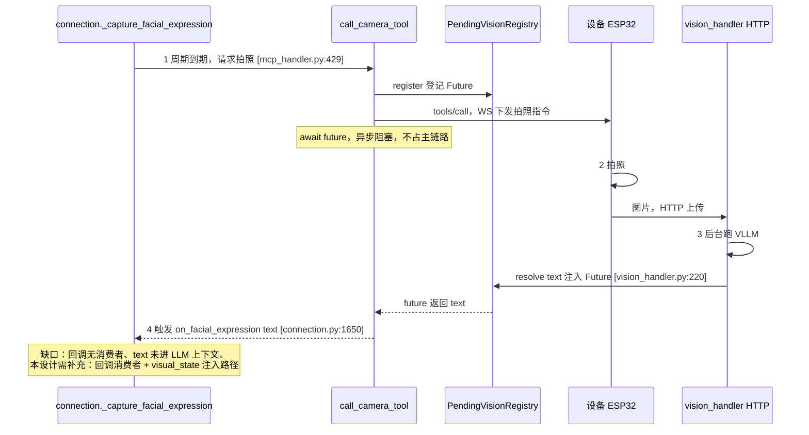
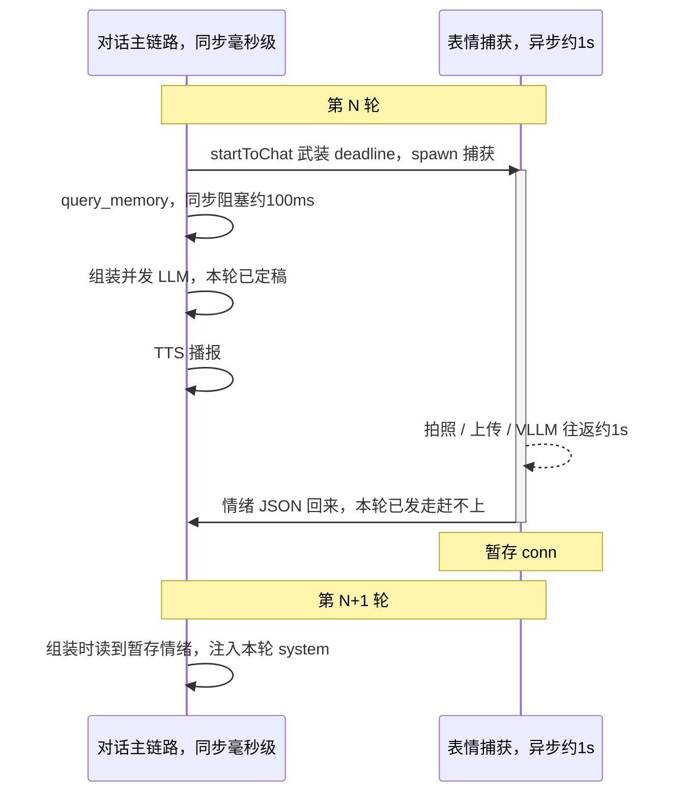
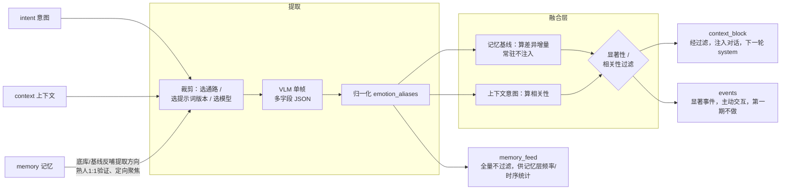

# 视觉感知融合模块设计方案

> **设计目标**：构建多通路视觉信息提取机制，实现有效视觉信息的融合处理，支撑视觉增强对话、视觉实时交互、记忆沉淀三类下游应用场景。
> 
> 
> 
> **设计思路**：以人类视觉交互的核心能力为参照，对标实现机器人对应的视觉感知能力。
> 
> 
> 
> **更新日期**：2026\-07\-16
> 
> 

---


## 0\. 当前架构与设计边界

以下为现有架构的既定现状，是本方案设计与落地的基础约束边界。


### 边界一：视觉结果已回流至服务端，但未注入大语言模型上下文

视觉链路采用 `PendingVisionRegistry` 异步注入模式：

- `call_camera_tool`（`mcp_handler.py:429`）注册一个 `Future` 对象，并向设备下发 `self_camera_take_photo` 指令；设备通过HTTP将图片上传至 `vision_handler`，后者后台运行视觉大模型（VLLM）并调用 `registry.resolve()` 向 `Future` 注入结果（`vision_handler.py:220`），`call_camera_tool` 获取文本结果后返回。

- 因此VLLM输出的文本结果会回流至服务端Python进程：`_capture_facial_expression`（`connection.py:1653`）获取 `expression_text` 后，触发 `on_facial_expression` 回调（`connection.py:1650`）。

- **待填补的能力缺口**：`on_facial_expression` 回调钩子在全代码库中无任何消费逻辑，也没有对应链路将视觉文本注入LLM上下文。因此本方案的核心工作并非从零搭建视觉信息接入LLM的完整架构，而是**实现回调消费逻辑 \+ 补充上下文注入通路**。

该链路跨设备端、`vision_handler`、注册中心、`connection` 四层模块，通过共享 `Future` 对象实现异步结果汇聚。链路核心特征为**指令下发与结果回流分属两条独立路径**：MCP指令通过WebSocket下发，图片通过HTTP上传，二者在 `Future` 处完成汇合。时序如下：



> 关键说明：**指令下发走WebSocket、图片上传走HTTP，为两条独立路径**，最终在共享 `Future` 处汇合——`call_camera_tool` 通过 `await future` 挂起，直到 `vision_handler` 将VLLM结果 `resolve` 注入后才返回。
> 
> 


### 边界二：周期性感知触发机制已就绪，无需重复建设

服务端已具备完整的周期拍照机制：

- `facial_expression_interval` 参数（`connection.py:238`，默认30秒）支持 `private_config > env > config.yaml` 三级配置覆盖，设为0时关闭功能。

- `_check_timeout()` 循环通过 `facial_expression_deadline` 驱动周期触发（`connection.py:1743-1753`）：对话轮次开始时在 `startToChat` 中武装定时（`receiveAudioHandle.py:64`），`sendAudio(LAST)` 时清零计时（`sendAudioHandle.py:62`）。

- **实际捕获节奏**：每轮对话开始捕获首帧；若持续超过 `facial_expression_interval`（默认30秒）仍无新轮次，则按该间隔周期补采一帧。即"每轮一帧 + 长时无对话时每30秒一帧"，`facial_expression_interval` 控制的是后者（周期补采间隔），而非"每30秒才拍一次"。

- 机制已包含MCP握手竞态处理、`_facial_expression_running` 并发防护、超时兜底、连接关闭时任务取消等能力（`connection.py:1479`）。

- 本方案**主方案**复用该触发机制，不新增独立触发链路，仅做三处调整：①优化间隔参数（30秒合理性见第6章额度测算）；②将单帧自由文本提示词升级为结构化JSON格式（见第2章）；③补充回调消费逻辑（见第3章场景A）。场景A 的**备用方案**（第一期可选）会在此之外新增一条"用户开口补采一帧"的触发，属主方案外的可选增强，详见第3章场景A备用方案与第5章落点表。

### 边界三：VLM仅负责单帧观测，长短期时序能力归属记忆层

归一化引擎（`prompts/emotion_aliases.json`）已完成原型开发，同名异物、同物异名的一致性统一通过该层实现，不由VLM承担。跨帧统计、事件确认能力同样归属记忆层，本模块仅负责输出稳定、归一化的单帧观测数据流。

---


## 1\. 能力映射：人类视觉行为 → 机器人感知能力

本方案以人类视觉的实际应用场景为锚点，匹配对应的机器人感知能力，同时明确下游落地场景与能力可靠性边界。可靠度数据来源于`test/pipeline_tests/VLM识别能力测试报告.md`（基于受控数据集得出，为乐观上限值，真机环境需重新实测验证）。


|人类视觉行为|对应机器人感知能力|支撑下游场景|实测可靠度（受控样本库下为乐观上限）|
|---|---|---|---|
|判断对话对象身份|人物在场检测、人数统计、熟人/陌生人区分|交互 \+ 记忆|人脸1:1验证准确率96%（依赖人脸底库）；1:N身份识别场景下VLM无法稳定输出|
|根据对方情绪调整对话语气|粗粒度情感识别|对话|粗分类可靠（高兴/惊讶/平静/负面）；细粒度情绪闭集准确率49%，开放集归一后准确率55%，不足以直接支撑决策|
|判断对方是否关注自己、是否分心|注意力检测、人脸朝向判断|交互|人脸朝向可检测（未专项测试，保守归为粗粒度能力）|
|结合"这个/那个"等指代与手势/手持物品理解|指代消解（手持/指向物体定位）|对话|物体粗分类能力强（物种识别准确率100%），支持画面内九宫格定位|
|判断所处环境、当前活动|场景分类 \+ 活动识别|对话 \+ 记忆|闭集场景枚举识别结果可靠|
|察觉新物体出现、有人进入|帧间变化检测、事件识别|交互 \+ 记忆|归属记忆层跨帧统计能力，非VLM单帧可实现|
|沉淀环境稳定事实（住址、宠物、家具位置）|高频稳定信息沉淀|记忆|通过频率统计实现，VLM仅提供观测数据流|


**核心设计原则：以能力边界约束方案设计。** 基于实测结论反向约束设计范围：

- **细粒度识别能力不足 → 降级使用或调整应用场景**：情感仅输出五大粗分类，细粒度的情绪、物体类别仅用于记忆沉淀，不作为交互决策的直接依据。

- **1:N身份识别不可靠 → 调整问题形态**：身份识别不采用开放域1:N识别模式，仅基于记忆底库开展1:1身份验证，将VLM不擅长的开放问题转化为准确率可达96%的判定类问题。

- **单帧无时序推理能力 → 时序逻辑交由记忆层实现**：VLM仅标注“当前帧疑似存在挥手动作”，不做“用户刚进门”这类时序因果判断，跨帧逻辑关联由记忆层实现。

---


## 2\. 视觉提取通路设计

### 2\.1 现状与升级方向

当前单帧视觉提取采用**单句自由文本提示词**模式（`connection.py:243`）：

```Plain Text
请识别图片中人脸的表情，用简短的中文描述表情类型和情绪状态，
例如'开心'、'疑惑'、'平静'、'惊讶'、'难过'等。如果图片中没有清晰的人脸，请回复'未检测到人脸'。
```

输出结果为自然语言文本。**存在的问题**：自由文本无法被下游结构化消费（归一化处理、显著性判定、记忆频率统计等逻辑均依赖字段化数据），且单次调用仅覆盖情感识别单一维度。


**升级方向：单次VLM调用输出多字段结构化JSON结果。** 不采用“单通路单次VLM调用”的模式（会带来N倍的延迟与额度消耗），各信息通路对应JSON中的字段分组。核心依据为**单次调用可摊薄网络往返开销**——实测表明单图API的网络往返是延迟主要来源（flash模型p50延迟约1s，详见延迟测试报告），多次调用会导致延迟与额度成本成倍增长。


### 2\.2 通路划分（对应JSON字段分组）

- **通路A · 人物信息**：包含`present`（是否存在清晰人脸）、`count`（画面人数）、`identity`（熟人ID/陌生人，依赖记忆底库完成1:1验证）、`emotion`（情绪粗分类）、`attention`（是否面向镜头）、`appearance`（粗粒度外观特征，如佩戴眼镜、身着外套等，支撑自然对话表达）。

- **通路B · 场景信息**：包含`scene_type`（闭集枚举：客厅/卧室/办公室/会议室/教室/商店等）、`lighting`（明亮/昏暗/自然光）、`time_hint`（白天/夜晚线索）。

- **通路C · 物体信息**：实体列表格式为 `[{name(半开放规范通用名), category(闭集分类), attributes, region(画面九宫格), state}]`。名称采用半开放输出，下游经归一化引擎统一命名（复用 `emotion_aliases` 同款硬映射机制）。

- **通路D · 活动/指代信息**：包含`activity`（吃饭/工作/看手机）、`deixis`（对话出现“这个/那个/我手里的”等指代时，定位被指向/手持的物体，支撑指代消解）。

- **通路E · 帧内动态提示**：`dynamic_hint` 仅标注“当前帧疑似瞬时动作”（如挥手/起身），**不做时序因果判断**，仅作为记忆层短时连续检测的输入原料。

### 2\.3 按意图裁剪提示词（降低Token消耗）

各通路可根据业务意图（`intent`）动态裁剪启用范围：环境巡检模式（`ambient`）仅启用A、B通路精简版；用户定向提问场景（`user_query`）仅启用C、D通路定向版。避免全字段输出带来的token损耗——该机制是第6章额度管控的必要支撑，而非可选优化项。


### 2\.4 前置改造：Provider参数化（结构化输出的基础）

结构化JSON输出依赖Provider支持温度系数、JSON模式、思维链开关等参数透传，但当前`core/providers/vllm/openai.py`未实现参数有效透传：

- `__init__`方法（第20\-35行）**已读取**`max_tokens`、`temperature`、`top_p`等配置并存为实例属性；

- 但`response()`方法（第60\-62行）发起实际请求时，**仅传递了**`model`、`messages`、`stream`三个参数——已读取的配置参数全部未生效，同时缺少`response_format`（JSON模式）与思维链开关的配置能力。

即存在“参数已读取但未实际透传至API请求”的问题。根据VLM能力评测结论，结构化提取需要满足“关闭思维链 \+ 温度系数0\.2 \+ JSON模式”的配置要求，当前Provider均无法支持。


因此本模块落地的首要步骤是改造`response()`方法，将已读取的参数完整传入`chat.completions.create`接口，并新增`response_format`与思维链开关的参数透传能力。该改造是所有结构化输出能力的基础，优先级最高。

---


## 3\. 核心场景落地流程

### 场景A：情感感知增强对话 （完整落地示范）

**支撑能力**：通路A的粗粒度情感识别能力。


**触发机制**：**复用主线程已有的****`_capture_facial_expression`****周期任务**（对应`connection.py:1653`），不新增独立触发链路。对话轮次启动时，`startToChat`已触发首帧图像捕获（对应`receiveAudioHandle.py:64`），捕获节奏见边界二（每轮一帧 + 长时无对话时按`facial_expression_interval`周期补采）。**主方案仅需完成两项改造：替换视觉提取提示词、实现回调消费逻辑**；若第一期同时启用后文的**备用方案**（当轮同步补采），则在此之外另需补采触发、同步等待、启用开关三项（详见第5章落点表）。


**提取提示词配置**：关闭思维链、温度系数0\.2、启用JSON模式；情绪粗分类基于实测结论设置，高兴、惊讶、平静三类识别可靠，负面情绪不做细分。**替换**`connection.py:243`处现有的自由文本提示词，内容如下：

```Plain Text
你是视觉情感观测器。仅识别画面中距离镜头最近、最清晰的人脸，判断其当前情绪。
仅可从以下粗分类中选择一项输出：高兴 / 惊讶 / 平静 / 负面 / 看不清。
"负面"为愤怒、厌恶、悲伤、恐惧的统称，无需区分具体类型。
仅输出JSON，不添加任何解释文字：
{"present": true|false, "emotion": "上述五选一", "salience": 0.0-1.0}
present：是否存在可清晰识别的人脸；salience：情绪表达强度，数值越高越明显。
```

> 注意：该提示词的JSON输出依赖Provider完成第2\.4节的JSON模式改造；若未完成改造，小模型可能返回附带解释文字的非标准JSON，需配套与`kill_switch.py`同款的容错解析逻辑作为兜底。
> 
> 


**信息处理流程**：

```Plain Text
_capture_facial_expression 周期触发（已有机制）
  → call_camera_tool 获取VLLM输出的JSON文本（已有链路）
  → 触发on_facial_expression回调（已有钩子，本方案新增消费逻辑）
  → 归一化处理（通过emotion_aliases硬映射统一表述，如“开心”映射为“高兴”）
  → 时序平滑处理（近N帧滑窗投票，过滤单帧噪声）    ← 状态存储于conn对象，跨轮次累积
  → 显著性判定：情绪非平静且稳定持续 → 标记为“可注入状态”
  → 渲染生成<visual_state>标签，写入conn的待注入缓冲区
```


**上下文融合方案（核心改造点，复用****`dialogue.py`****已验证的注入范式）**：

`get_llm_dialogue_with_memory`方法（`dialogue.py:126`）已具备两条成熟的注入路径：`<memory>`标签的正则替换路径（第169\-175行），以及`tool_rules`追加至system消息末尾的路径（第178\-179行）。


本方案**平行新增****`<visual_state>`****注入通路**，采用与`tool_rules`一致的“追加至system消息末尾”模式，而非`<memory>`标签的“替换预留标签”模式。


**选择追加至system末尾而非注入user消息的原因**：

`dialogue.py`第176\-177行的注释已说明核心依据：追加至system消息末尾，经对话模板渲染后紧贴上下文，且不进入对话历史，可避免被模型判定为“最新用户消息”而触发错误的响应逻辑。


情绪状态标签同理：若注入user消息，模型会将其识别为用户输入，进而生成“你为什么说我不开心”这类不符合预期的响应。该决策直接复用现有代码已验证的结论，不新增独立方案。


渲染示例：

```Plain Text
<visual_state ts="14:32">
对话对象：主人（已识别）。情绪：负面，已持续约20秒，强度中等。
</visual_state>
```


系统提示词追加使用规则（自然含蓄是人际交互的核心原则）：

```Plain Text
<visual_state> 是你"看到"的实时状态，仅用于调整你的对话方式，不可作为事实直接复述。
- 若对方情绪偏负面：语气更柔和关切、语速放缓，先共情再回应内容。
- 绝对禁止机械说出"我看到你不开心""我检测到你的表情"——人类日常对话不会这样表达。
- 情绪无法识别或状态为平静时，按正常模式对话，忽略该标签。
```


#### ⚠️ 时序耦合决策（核心落地问题）

`chat()`方法（`connection.py:957`）以同步方式组装LLM请求，`query_memory`在第1052行同步阻塞获取记忆数据后，立即发起LLM请求。而`_capture_facial_expression`是**异步周期任务**，flash模型的VLM往返p50延迟约1s，p95长尾延迟更长。**单帧情绪识别结果通常无法同步用于当前轮次的LLM请求组装**。


对话主链路为毫秒级同步推进，表情捕获为秒级异步推进，二者并行运行——当VLM识别结果返回时，当前轮次的LLM请求通常已发出（下图为**主方案**时序；备用方案的当轮同步见后文）：




因此明确设计决策：**情绪状态标签注入下一轮（及后续轮次）的system消息，接受一轮延迟**。依据如下：

- 情绪属于持续状态而非瞬时事件，滞后一轮（数秒）不会影响“调整语气、柔和回应”的核心目标；

- 若强制等待VLM结果再发起LLM请求，会将p95长尾延迟（12\~20s，详见延迟报告）直接叠加到用户感知的首字延迟（TTFB）上，体验损失过大；

- 与`query_memory`“读取当前可用状态、不阻塞主链路”的既有设计取舍保持一致。

否决方案：同步等待VLM结果。否决理由：长尾延迟不可控，用户体验损失严重。

**备用方案：当轮同步补采（前提——产品侧可接受每轮首字延迟增加约1~2s）**

上述否决基于"长尾不可控"，但该结论针对的是glm-4.6v（p95长尾12~20s）。情感场景A 本就属环境巡检类、默认用 flash（p50约1s、p95约2.5s，详见延迟报告，与第6章模型选型一致）——flash 的低长尾特性叠加硬超时上限，即可将长尾截断在可接受区间内。此时可让情绪用于**当前轮**而非滞后一轮：

- **触发**：用户开口（`startToChat`）时，除周期捕获外，额外补采一帧，保障情绪与本轮对话强相关（而非复用可能已过时30s的周期帧）。
- **同步等待**：在`chat()`组装LLM请求前（`query_memory`同款位置，`connection.py:1052`附近），同步`await`本帧的VLM future，但**超时上限设为1~2s**——区别于`call_camera_tool`现有的15s超时（`facial_expression_timeout`，那是给设备端MCP的宽松上限），此处必须卡死在体验可接受区间。
- **降级**：超时或识别失败 → 回退主方案，改用conn暂存的上一轮情绪（滞后一轮），绝不无限等待。
- **实际效果**：flash p50约1s，多数轮次能在上限内拿到当前帧情绪并注入本轮system；少数p95长尾轮次超时后降级为滞后一轮。即"常态当轮、长尾滞后"的混合策略，比纯主方案实时性更好，比纯同步等待更稳。

**关键约束（真机延迟账）**：延迟报告的约1s是**VLM api往返**，不含设备端拍照 + HTTP上传。真机整链路（拍照 → 上传 → VLLM）更长，超时上限建议取2s并以真机实测校准；若真机p50已逼近2s，说明当轮同步不划算，应退回主方案。

**与主方案的关系**：主方案（滞后一轮、不阻塞）为默认；本备用方案是"以TTFB换情绪实时性"的可选项，由`facial_expression_interval`之外新增一个开关控制。两者共用同一套提取/归一化/注入逻辑，差异仅在"何时注入"——因此可低成本并存，按产品对延迟的容忍度切换。


**输出产物**：`{emotion, salience, stable_since}`结构化数据 \+ 渲染完成的`<visual_state>`标签块，暂存于conn对象中，在下一轮`get_llm_dialogue_with_memory`组装上下文时追加至system消息。


### 场景B：场景/环境感知 → 情境化对话 \+ 记忆沉淀

**支撑能力**：通路B \+ 通路C。


**提取提示词**（`ambient`意图精简版，闭集枚举 \+ 半开放物体名）：

```Plain Text
你是环境观测器。仅输出JSON，不加解释：
{"scene_type":"客厅/卧室/办公室/会议室/教室/商店/其他 之一",
 "lighting":"明亮/昏暗/自然光 之一",
 "objects":[{"name":"通用名","region":"九宫格(左上/上/右上/左/中/右/左下/下/右下)","state":"简述或null"}]}
objects 仅列画面中显著、可命名的物体，最多8个；没有则空数组。
```


**信息处理流程**：

```Plain Text
周期帧 → VLM（上述提示词）→ 物体名归一化（emotion_aliases 同款硬映射）
  → 融合层基于记忆基线做对比（memory传入的"常驻场景/已知物品"）
  → 仅将【新增 / 变化 / 与当前话题相关】的信息标记可注入
    （如用户问"帮我找眼镜" → 命中话题相关 → 注入"眼镜在画面右下"）
  → 渲染进 <visual_state>
```


**上下文融合**：复用同一个`<visual_state>`标签，追加场景/物体信息块，示例：

```Plain Text
<visual_state ts="14:35">
场景：书房（自然光）。检测到：笔记本电脑、水杯、眼镜(右下)。
</visual_state>
```


**采用非全量注入的原因**：沙发、桌子这类常驻物体每帧都存在，全量注入既浪费Token又会淹没有效信息。融合层基于记忆基线计算差异增量，仅推送新增、变化或与话题相关的信息——这正是第4章“融合处理”区别于“无差别单帧描述”的核心本质。未注入对话的信息不会丢弃，仍会全量输入记忆层（见场景D）。


### 场景C：指代消解 / 视觉实时交互

- **指代消解**：对话上下文检测到“这个/那个/我手里的”等指示代词 → `intent`切换为`user_query` → 触发通路C/D定向提取（定位手持/指向物体）→ 直接生成回答填入`answer`字段。

- **实时主动交互**：融合层检测到事件（如通路A中`present`从false变为true，判定为“有人进入”）→ 记忆层通过短时连续算法确认事件有效 → 机器人主动开口交互。

该场景需新增“主动发言/打断”通路，现有架构暂不支持该能力：主线程仅支持“用户提问→机器人回答”的单向模式，机器人因视觉信息主动开口、打断当前TTS播报涉及抢麦（barge\-in）机制，改造成本较高。**建议第一期暂不落地**（详见第6章分期规划）。


### 场景D：记忆沉淀（对接整体路线图，本模块仅负责数据输出）

融合层将每帧观测结果（无论是否注入对话）以`VisualObservation`数据流交付记忆层。写入时机与主线现有机制对齐：`query_memory`在每轮对话开始时同步读取（`connection.py:1052`），`save_memory`在连接断开时异步写入（`_save_and_close`，`connection.py:348-372`，守护线程异步执行）。


长短期时序逻辑由记忆层通过频率统计、短时连续两套算法实现（整体路线图已明确），本模块仅保障观测流稳定输出、物体名称已归一化。

---


## 4\. 模块输入输出契约 ⭐（核心接口定义）

模块对外提供统一接口。**上下文与记忆均作为输入条件**——这正是“有效信息融合”的核心：视觉提取过程受对话上下文与记忆数据约束，而非无差别地对单帧图像做全量描述。


```Python
VisualPerception.perceive(
    frames:   List[Frame],        # 摄像机图像帧：当前帧，可选近几帧历史
    context:  DialogueSnapshot,   # 对话上下文（近若干轮），用于定向提取、指代消解
    memory:   MemorySnapshot,     # 记忆快照：熟人底库、常驻场景基线、已知物品
    intent:   Intent = "ambient"  # 枚举：ambient | user_query:<text> | event_check
) -> VisualObservation
```


### 与主线现有对象的映射关系（确保接口可落地）

- `frames` ← `call_camera_tool` 获取的图片（当前机制为设备HTTP上传至`vision_handler`，第一期单帧即可满足需求）。

- `context` ← `conn.dialogue`（`Dialogue`对象，`dialogue.py:25`），取近若干轮用户/助手消息。

- `memory` ← `conn.memory`（当前Provider，为`query_memory`的数据源）；熟人底库、场景基线属于记忆层第二期能力，第一期可传入空快照，模块需支持空快照降级（无底库时`identity`恒为stranger/unknown，不阻断流程）。

- 返回值消费方：`context_block` → 场景A/B注入对话；`answer` → 场景C直接回答；`events` → 场景C主动交互；`memory_feed` → 场景D输入记忆层。

### 输入上下文与记忆的核心价值（融合逻辑的核心体现）

- 记忆提供**熟人底库**，支撑1:1身份验证（不做开放1:N识别）；提供**场景/物品基线**，支撑融合层判断“哪些信息属于新增/变化，具备输出价值”。

- 上下文提供**提取方向指引**：例如用户提问“看看我手里的”时，可引导提取逻辑定向聚焦，而非全量描述画面；同时为指代消解提供参照依据。

- 意图决定**启用的通路、提示词版本与调用模型**（详见第6章）。

### 输出`VisualObservation`结构

```JSON
{
  "ts": "时间戳", "frame_id": "帧ID",
  "persons": [{"present": true, "identity": "owner|stranger", "emotion": "负面",
               "attention": true, "appearance": ["戴眼镜"], "activity": "看手机"}],
  "scene":   {"type": "书房", "lighting": "自然光", "time_hint": "白天"},
  "objects": [{"name": "水杯", "category": "餐具", "attributes": ["蓝色"],
               "region": "右下", "state": "空"}],
  "dynamic_hint": ["有人从画面外进入"],
  "answer": null,               // intent=user_query 时：直接回答用户的文本
  "context_block": "<visual_state>…</visual_state>",  // 已渲染、经融合过滤的注入块
  "events": [],                 // 融合层算出的显著事件，供主动交互
  "memory_feed": { "…完整观测…" }  // 全量观测流，喂记忆层（不受融合过滤影响）
}
```


`perceive`方法内部完整数据流如下。核心逻辑：**三类输入不仅作为VLM的输入信息，更反向约束提取与过滤过程**——`context`、`memory`、`intent`在VLM调用前决定启用的通路、提示词版本，在VLM输出后决定哪些观测属于有效信息。这正是“融合处理”区别于“无差别单帧描述”的核心本质。




- **VLM调用前**：`intent=ambient` 仅启用A、B通路精简版，`user_query` 仅启用C、D通路定向版，降低Token消耗；`memory`中的底库/基线提供“识别对象、关注区域”的方向指引。

- **VLM输出后**：基于`memory`基线计算差异增量（沙发为常驻物体→不注入，眼镜为新出现物体→注入）；基于`context`计算相关性（用户询问找眼镜→眼镜信息相关→注入）。

- **两路输出采用不同过滤规则**：`context_block` 经显著性过滤后才注入对话；`memory_feed` 全量不过滤，未注入对话的信息照常沉淀。

---


## 5\. 现有代码对接落点（全部锚定 origin/main）

|改造项|落点|现状|改造动作|
|---|---|---|---|
|**Provider参数化**（基础改造，优先级最高）|`core/providers/vllm/openai.py:60-62`|`response()` 仅传递 model/messages/stream，已读取的 temperature/max\_tokens 等参数全部未生效|将已读取参数完整传入 `create` 接口，新增 `response_format`（JSON模式）与思维链开关参数透传|
|**提示词升级**|`connection.py:243`|单句自由文本，仅覆盖情感识别|替换为第3章场景A/B对应的结构化JSON提示词（按intent选择版本）|
|**回调消费者**（核心缺口）|`connection.py:1650` `on_facial_expression` setter|回调钩子已定义，**暂无消费逻辑**|新增消费逻辑：归一化 → 时序平滑 → 显著性判定 → 渲染 `<visual_state>` 暂存至conn|
|**上下文注入**|`dialogue.py:126` `get_llm_dialogue_with_memory`|已有 `<memory>` / `tool_rules` 两条注入路径|平行新增 `<visual_state>` 注入通路，采用与 `tool_rules` 一致的“追加至system末尾”模式（第178\-179行）|
|**周期触发**|`connection.py:1653` / `_check_timeout:1743`|**已完整实现**（默认30s）|不修改机制，仅调整 `facial_expression_interval` 参数值|
|**主动发言/打断**（场景C）|无对应落点|仅支持“提问→回答”单向模式|涉及TTS抢麦/barge\-in机制，**第一期不做**|

以下三项**仅在启用场景A备用方案（当轮同步补采）时需要**，属第一期可选范围：

|改造项（备用方案·第一期可选）|落点|现状|改造动作|
|---|---|---|---|
|**用户开口补采一帧**|`startToChat`（`receiveAudioHandle.py:64` 附近）|仅有周期捕获|用户开口时额外触发一次捕获，保障情绪与本轮强相关|
|**当轮同步等待**|`chat()` 组装前（`connection.py:1052` 附近）|无|同步 `await` 本帧 VLM future，超时上限1~2s，超时降级为上一轮情绪|
|**启用开关**|新增配置项|无|`facial_expression_interval` 之外新增开关，控制"主方案 / 备用方案"切换|


**核心判断**：**主方案**新增开发量仅集中于两处——Provider层`response()`方法的参数透传改造、`on_facial_expression`回调的消费逻辑实现，其余能力均复用已验证的现有范式。若第一期同时启用**备用方案**，则再增上表三项。这也是第一期最小化落地范围的核心依据。

---


## 6\. 分期落地规划、模型选型与额度测算

### 第一期：情感增强对话（最小化改造）

落地场景A及场景B的信息注入能力，仅打通“视觉信息接入对话上下文”的核心链路，复用现有触发与注入范式，暂不涉及主动交互能力。

- 交付范围（主方案）：第5章表格中前四项改造（Provider参数化、提示词升级、回调消费、上下文注入）。其中真正新增开发量为两处（Provider透传 + 回调消费），另两项复用现有范式，故第5章称"仅两处"、此处称"前四项"，二者口径一致，区别仅在"新增开发量"与"改动落点"两种计数方式。
- 可选增强（备用方案）：场景A的"当轮同步补采"，含第5章备用方案三项改造。是否启用取决于第7章第5条决策与真机延迟实测，默认不启用、走主方案。

- 模型选型（依据延迟测试报告）：环境巡检采用 **glm\-4v\-flash**（p50延迟约1s、p95延迟约2\.5s，粗分类能力满足需求，长尾延迟极低）；用户定向提问采用 **glm\-4\.6v**（细粒度识别能力更强，但p95长尾延迟达12\~20s，仅用户主动触发时可接受）。

#### ⚠️ 额度成本测算（生产环境首要风险点）

根据CLAUDE\.md文档记录，免费版glm\-4\-flash密集调用会触发接口限流（429错误）。周期采集模式意味着VLM将持续高频调用，必须明确额度消耗规模：

- 当前`facial_expression_interval`默认值为30秒。若单轮对话持续5分钟，单设备约产生10次VLM调用，叠加多设备并发将进一步提升调用量。

- 若为提升情绪实时性将间隔缩短至10秒，调用量将提升3倍，接口限流风险显著上升。

- **结论与取舍**：第一期间隔值**不低于30秒**（沿用默认配置）。情绪属于持续状态，无需10秒级刷新；在付费额度或本地VLM能力落地前，不追求高频采集。该约束需在部署文档中明确标注，避免作为功能异常排查。

### 第二期：能力扩展

完成记忆沉淀对接（观测数据流 → 记忆层频率统计），落地熟人底库 \+ 1:1人脸验证能力。依赖记忆层第二期能力就位。


### 第三期：体验完善

落地主动交互能力（事件触发 → 主动发言 \+ barge\-in打断）、指代消解定向提取能力。

---


## 7\. 待决策事项

1. **周期采集频率**：第一期`facial_expression_interval`参数取值为多少？（详见第6章额度测算。）

2. **熟人底库隐私方案**：是否接受在记忆模块存储人脸注册参考信息（涉及隐私数据），用于熟人/陌生人的1:1身份区分？（架构层面的隐私决策——第一期可通过空快照降级绕过，第二期必须明确方案。）

3. **细粒度负面情感识别能力不佳，如何处理**：实测VLM对负面情绪的细分能力不足（closed 49% / open归一后55%，详见第1章能力映射），无法可靠区分愤怒/厌恶/悲伤/恐惧。当前设计取舍是**只输出粗五分类、负面不细分**（见场景A提示词）。待决策：是否接受这一降级？若产品要求区分具体负面情绪（如"是生气还是难过"），需另择路径——可选项：a) 换更强的专用情感模型（增延迟与成本）；b) 结合ASR文本情感做多模态融合（视觉粗分类 + 文本细分）；c) 维持粗分类，细粒度只沉淀记忆、不用于交互决策。建议采纳c（风险最低、与"能力边界决定设计"原则一致）。

4. **VLM延迟方案，选哪个**：场景A给了两套并存方案，需产品拍板默认走哪套——a) **主方案**：情绪滞后一轮注入，不阻塞主链路，首字延迟无损失；b) **备用方案**：当轮同步补采，情绪用于当前轮，但首字延迟增加约1~2s（依赖flash + 硬超时，详见场景A"备用方案"）。取舍本质是"情绪实时性 vs 首字延迟"，两者可低成本并存、按开关切换。建议第一期默认走a，b作为可选增强、真机实测延迟账后再决定是否开启。

---


## 附录：关联文档与参考资料

- 视觉/记忆/上下文现状代码位置：记忆模块文档 `zerone-newserver-vision-memory-context`。

- VLM能力与延迟评测（情感粗分类、物种识别、人脸1:1、flash vs 4\.6v延迟对比）：[glm-4.6v对比glm-4v-flash_能力与延时对比.md](glm-4.6v对比glm-4v-flash_能力与延时对比.md)。

- 记忆模块长短期算法、归一化引擎：记忆路线图 `zerone-vlm-memory-roadmap`。

- 本模块所有代码锚点针对 `newserver` 仓库 `origin/main` 分支；`on_facial_expression`/`_capture_facial_expression`/`call_camera_tool`/`PendingVisionRegistry` 均为主线已合入实现，当前工作分支 `feature/vlm-vision-eval` 需先执行rebase/merge main操作后才可查看对应代码。

